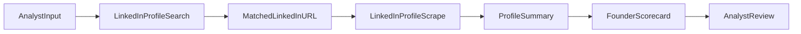

# founder-scorer-iq implementation notes (iq_fs_v0)

## Purpose
This document explains how the current `iq_fs_v0` prototype was built, why the product was shaped this way, which providers and endpoints were tried, what finally worked, and what the likely operating cost looks like if this prototype is run in production-like usage.

## Why This Product Was Built This Way
The prototype was intentionally narrowed to a LinkedIn-first workflow instead of a broad internet-scraping system.

Reasons:
- The highest-signal public source for a founder profile is usually LinkedIn.
- A LinkedIn-only version is much faster to validate than a multi-source diligence engine.
- It lets the analyst verify the matched profile before trusting the summary or score.
- It keeps the scoring explainable: every score can be tied back to visible profile evidence.
- It creates a clean base for future company scraping, news enrichment, and broader due-diligence layers.

In short, the product was made "live" in this shape because it is the smallest useful version that an analyst can actually test with real founders.

## Current Product Flow

Current user flow:
1. Analyst enters `founder_name` as the only required field.
2. Optional fields can improve quality:
   - `company_name`
   - `pitch_deck_pdf`
   - exact `linkedin_url`
3. The app either uses the analyst-provided URL or finds a best-guess LinkedIn profile.
4. It scrapes the profile.
5. It generates a short summary and a lightweight founder scorecard.
6. The report shows exactly which profile URL was used and allows re-running with a corrected URL.

## What We Actually Tried

### 1. Profile discovery
This part worked consistently.

- Provider: Apify
- Actor: `apify/google-search-scraper`
- Role: search Google for `site:linkedin.com/in`
- Used for: finding the likely LinkedIn profile URL from founder name and optional company/deck context

This remains in the product because it solved the profile-matching problem well enough for the prototype.

### 2. First LinkedIn scrape attempt
- Provider: Apify
- Actor: `dev_fusion/Linkedin-Profile-Scraper`
- Input key: `profileUrls`
- Result: failed for API use on free Apify plan

Observed issue:
- The actor explicitly returned an error saying free-plan users could run it via the UI but not through API/programmatic access.

Conclusion:
- This actor may work on a paid Apify plan, but it was not viable for API-driven prototype usage on the current setup.

### 3. Second LinkedIn scrape attempt
- Provider: Apify
- Actor: `dataweave/linkedin-profile-scraper`
- Input key: `urls`
- Result: failed with upstream `401`

Observed issue:
- The actor run started in Apify, but its own downstream backend returned `401 Unauthorized` while processing the LinkedIn URL.

Conclusion:
- Even though the actor page and UI run looked promising, it was not reliable enough for this prototype path.

### 4. Considered fallback on Apify
- Provider researched: `sourabhbgp/linkedin-profile-scraper`
- Input key: `profiles`

Important note:
- This was researched as a fallback option, but it was not the final selected provider for the working path.

### 5. Final working LinkedIn scrape path
- Provider: LinkdAPI
- Endpoint: `GET https://linkdapi.com/api/v1/profile/full`
- Auth header: `X-linkdapi-apikey: <your_key>`
- Query param: `username=<linkedin_slug>`
- Result: this became the final working profile-scrape path

Important implementation detail:
- The official `linkdapi` Python SDK required Python `>= 3.10`.
- The prototype environment was on Python `3.9`.
- To avoid changing the whole runtime, the final integration was done via direct HTTP using `httpx`.

## Endpoint and Provider Summary

### Tried and tested
1. `apify/google-search-scraper`
   - Purpose: LinkedIn profile discovery
   - Status: worked

2. `dev_fusion/Linkedin-Profile-Scraper`
   - Purpose: LinkedIn profile scrape
   - Status: failed for free-plan API access

3. `dataweave/linkedin-profile-scraper`
   - Purpose: LinkedIn profile scrape
   - Status: failed with upstream `401`

4. `GET https://linkdapi.com/api/v1/profile/full?username=<slug>`
   - Purpose: LinkedIn full profile scrape
   - Status: final working path

### Current live stack
1. Apify Google Search actor for LinkedIn URL matching
2. LinkdAPI for the actual LinkedIn profile scrape
3. Anthropic for summary and score generation

## Pricing by Provider

### Apify platform
- Free tier: includes monthly credits, enough for light experimentation
- Starter plan: about `$29/month` according to current public pricing

Important nuance:
- Apify platform pricing and actor pricing are separate.
- You can pay Apify for platform usage and still pay actor authors separately.

### Apify actor pricing observed during evaluation
- `dev_fusion/Linkedin-Profile-Scraper`: about `$10 / 1000 profiles`
- `dataweave/linkedin-profile-scraper`: about `$2 / 1000 profiles`
- `sourabhbgp/linkedin-profile-scraper`: about `$2 / 1000 profiles`
  - public docs also indicate extra platform/compute usage on top

### LinkdAPI pricing
- Free test allocation: `100 free credits`
- Public positioning: pay-as-you-go / usage-based
- Public estimates seen during evaluation: roughly `$0.005-$0.01` per enrichment, depending on endpoint and usage tier

Important note:
- Exact LinkdAPI cost should be checked against the live dashboard because credit burn can vary by endpoint and provider pricing can change.

## What Finally Worked
The final working combination for this prototype is:

- **Profile discovery:** `apify/google-search-scraper`
- **Profile scraping:** `LinkdAPI /api/v1/profile/full`
- **Scoring:** Anthropic

This was chosen because:
- Apify remained useful for discovery/search.
- LinkdAPI was more appropriate for stable API-based profile retrieval.
- The overall analyst workflow stayed clean and auditable.

## Estimated Operating Cost If We Actually Run This

## Cost model per founder
The current prototype run has three main cost components:

1. **LinkedIn profile discovery**
   - Source: Apify Google Search actor
   - Expected cost: low relative to the actual profile scrape
   - Best measured directly from Apify usage logs once real usage starts

2. **LinkedIn profile scrape**
   - Source: LinkdAPI
   - Expected cost: roughly around `$0.005-$0.01` per founder profile lookup based on public estimates

3. **LLM scoring**
   - Source: Anthropic
   - Cost depends on:
     - chosen model
     - prompt size
     - response size
   - For this prototype, the scoring prompt is relatively small, so the expected cost is usually in the low-cent range per founder rather than dollars per founder

## Practical budget guidance

### Small prototype usage
- `100 founders`: likely a modest spend, roughly in the range of a few dollars to low tens of dollars, depending mainly on LLM usage and LinkdAPI credit burn

### Moderate internal usage
- `1,000 founders`: likely tens of dollars for LinkedIn scraping plus additional LLM cost

### Full production-like diligence system
If this product later expands into:
- company scraping
- news enrichment
- social signal analysis
- batch processing
- CRM sync

then costs will increase much more because:
- more providers get involved
- token usage grows
- retries and fallback logic become necessary
- storage and job orchestration become material

## Recommended Interpretation of Cost Today
For the current LinkedIn-only prototype, cost is not the main risk. Reliability and data quality are the main risks.

That means the current cost posture is reasonable:
- cheap enough to test
- simple enough to explain
- good enough to validate whether analysts actually want this workflow

## Recommendation Going Forward
If this prototype continues to work in analyst testing:
1. Keep LinkdAPI as the primary LinkedIn profile provider.
2. Keep Apify for discovery/search and future non-LinkedIn enrichment.
3. Measure real per-founder cost from:
   - LinkdAPI usage logs
   - Apify run costs
   - Anthropic billing
4. Revisit whether Apify Starter is needed only when the product expands beyond LinkedIn profile lookup.

## Bottom Line
The product was intentionally made narrow so it could be validated quickly.

What worked:
- Apify for finding the right LinkedIn URL
- LinkdAPI for actually scraping the profile

What did not work well enough:
- API-based profile scraping through multiple Apify marketplace actors

Current expectation:
- the LinkedIn-only prototype should be inexpensive enough to test seriously
- the next important question is not cost, but whether the analyst output is consistently useful
